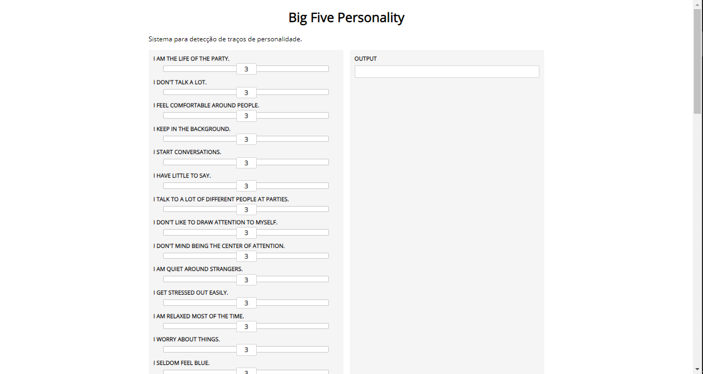
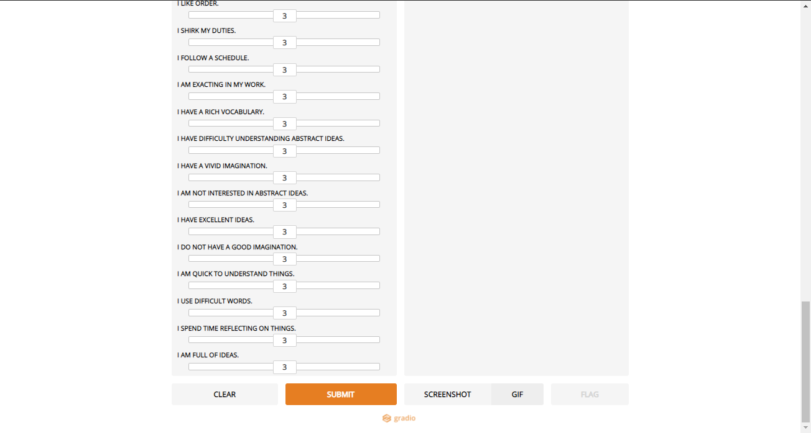

# Big Five Personality

## Five Personality Traits (OCEAN)
- Openness to experience (inventive/curious vs. consistent/cautious)
- Conscientiousness (efficient/organized vs. easy-going/careless)
- Extroversion (outgoing/energetic vs. solitary/reserved)
- Agreeableness (friendly/compassionate vs. challenging/detached)
- Neuroticism (sensitive/nervous vs. secure/confident)

#### Analyzing the database <https://www.kaggle.com/tunguz/big-five-personality-test> and creating a gradio interface.

## Gradio Interface

